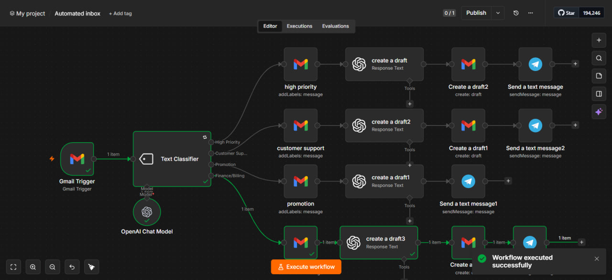

# AI Email Automation System

An AI-powered email automation workflow built using n8n that automatically classifies incoming Gmail messages, generates AI-powered draft responses, applies Gmail labels, and sends Telegram notifications.

## Features

- Monitors unread Gmail messages
- Classifies emails into:
  - High Priority
  - Customer Support
  - Promotion
  - Finance / Billing
- Generates AI-powered draft replies
- Creates Gmail drafts automatically
- Applies Gmail labels
- Sends Telegram notifications

## Technologies

- n8n
- OpenAI
- Gmail API
- Telegram Bot API

## Workflow

The workflow monitors incoming unread Gmail messages, classifies each email using AI, generates an appropriate response or summary based on the category, creates a Gmail draft when needed, and sends a Telegram notification.

## Files

- `ai-email-automation-system.json`
- `workflow.jpg`
- ## Workflow

